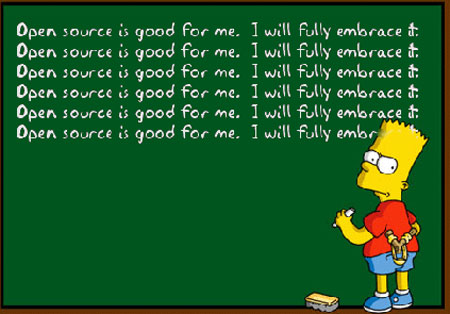
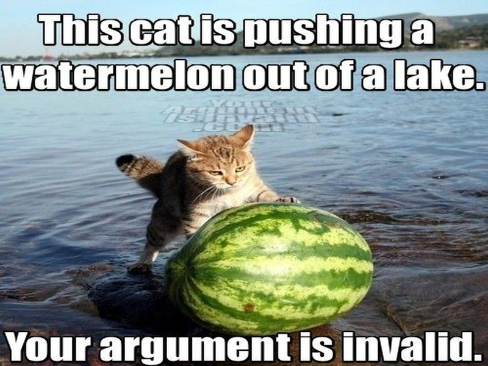

# What is Open Science 

 

 - Access to Materials     
 - Reproducible/ Repeatable    
 - The Web!                   
 - A Process, not a state                       

# {.segue-img}

# Open Access

# Open Data

# The Web!

# How I became a Zealot

> - Twitter
> - GitHub
> - Open Source Tools

# Twitter

# GitHub

# Open Source GIS

# R

# Online Identity

# Does any of this matter?

# {.segue-img}

