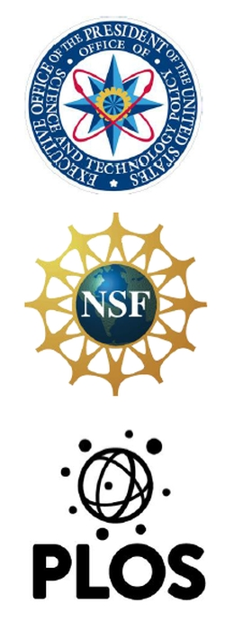
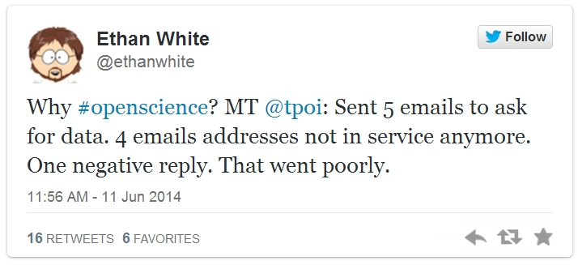
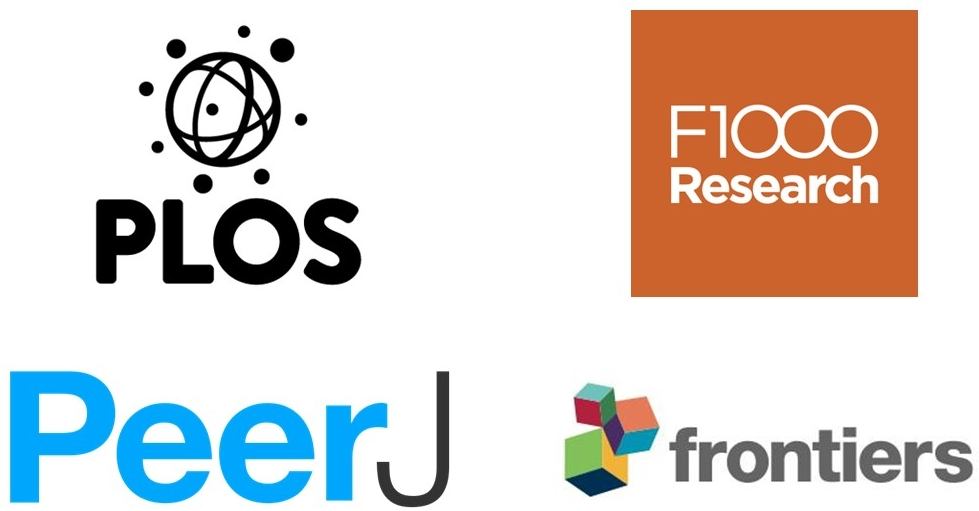
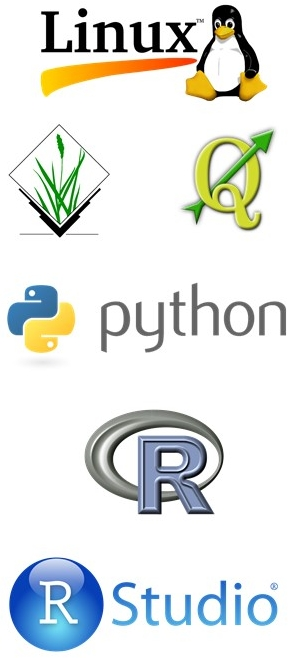
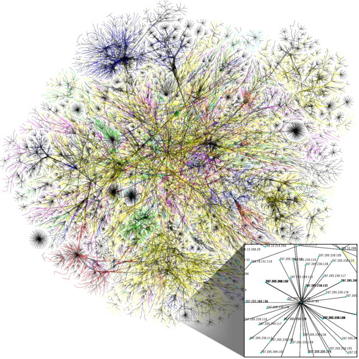
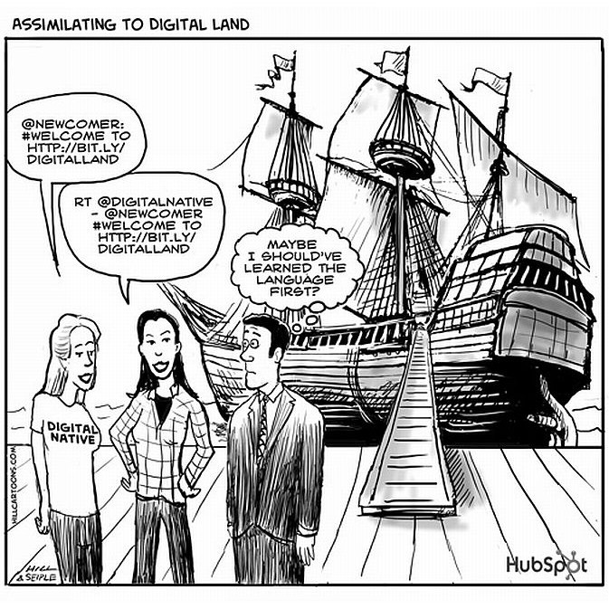
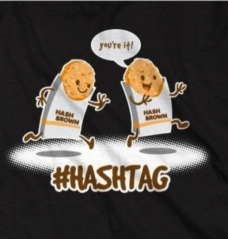
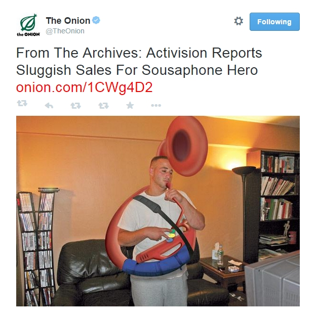
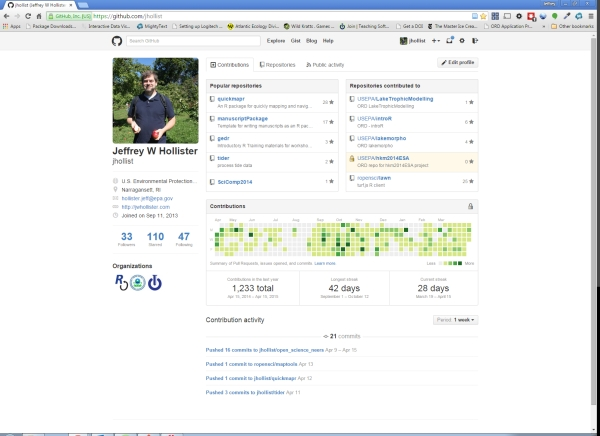
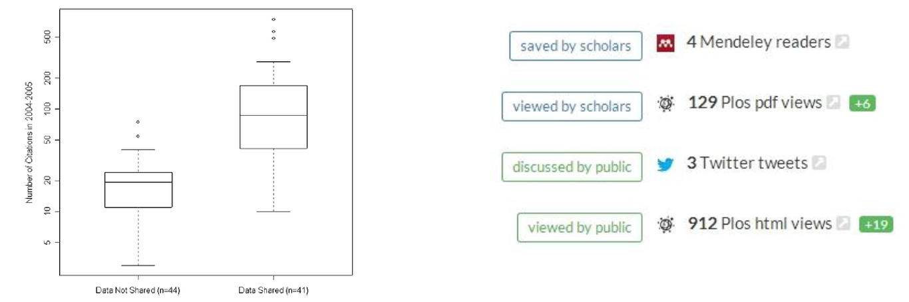

# what is open science? {.segue-txt}

# what is open science? 

 

 - Access to materials     
 - Reproducible/ Repeatable    
 - The Web!                   
 - A process, not a state                       

# why open? {.segue-txt}

# why open?

 

 - Government
     - Feb 2013
     - John Holdren, White House OSTP
 - Funders    
     - NSF
 - Publishers
     - PLoS

# why open?

 - Keeps us honest
 - Prevents this ...

 

# how do you do open science? {.segue-txt} 

# how: open access

  - Online
  - Available to all
  - Types:
      - Green
      - Gold
      - Hybrid

 
  

# how: open access

  

# how: open source
  

  - FOSS
      - Free
          - speech, not beer
          - but often also beer
      - Open Source
  - MANY examples
      - QGIS
      - GRASS
      - R
      - Python
      - RStudio
      - Linux

 
  

# how: open data

- Gradient of open data
- APIs
- Formal Linked Open Data

 

# how: the web!

 - Old concepts
 - New tools
 - New implementation

 
  
  
image credit: [opte.org](http://www.opte.org/maps/) 

# becoming a zealot {.segue-txt}

# becoming a zealot

 - Twitter
 - GitHub
 - Open Source Tools
     - Geospatial
     - R

 
  
  
image credit: [Hill and Seiple](http://juice-marketing.com/blog/wp-content/uploads/2012/10/4441164310_3b574edf0d_o.jpg) 

# twitter {.segue-txt}

# twitter

  - Micro-blogging site
  - Limited to 140 Characters
  - Purpose: Share what you want, but keep it short (my definition)
  - Followers, Following, Tweets, handles, hashtags
      - @jhollist
      - @AJO4444
      - @CoastalSociety
      - \#openscience

 
  
  
image credit: [indeterminate/twitpic](https://twitpic.com/dgj4t6) 

# twitter for science

 - collaborations
     - @ropensci
     - @softwarecarpentry
     - @datacarpentry
     - @MozillaScience
 - \#icanhazpdf
 - \#rstats
 - live-tweet meetings
     - \#neers2015
     - \#openscience
 - low time investment

 
  
  
image credits: [The Onion](https://twitter.com/TheOnion/status/588041206673895424)
  

# GitHub {.segue-txt}

# GitHub

  - social coding/collaborating
  - Not just code
      - Any text
  - Social component
  

 

# geospatial tools {.segue-txt}

# geospatial tools
 
 - Open source GIS
     - [GRASS](http://grass.osgeo.org/) 
     - [QGIS](http://www.qgis.org/en/site/about/features.html)
     - [GeoServer](http://geoserver.org/)
 - javascript
     - [leaflet](http://leafletjs.com/)
     - [D3](http://d3js.org/)
     - [Turf.js](http://turfjs.org/)

# R {.segue-txt}

# R

 - Free environment for statistical computing
 - Very active community 
 - Extended with Packages (6533 as of 4/15/15)
 - Best known for:
     - stats
     - visualization
 - But also a general purpose languages
 
# R

  - My one stop shop
  - Writing
  - Presentations
  - Analysis
  - All my geospatial work
  
# R Highlights

  - Maps in R
      - [Example 1](http://spatialanalysis.co.uk/wp-content/uploads/2012/02/bike_ggplot.png)
      - [Example 2](http://paulbutler.org/archives/visualizing-facebook-friends/facebook_map.png)
  - Shiny
      - [Example 1](http://www.davesteps.com/sst/)
      - [Example 2](https://rasmusab.shinyapps.io/drinkr/)
  
# tangent: online identity {.segue-txt}

# online identity

*If you are not curating your online identity, someone or something else is doing it for you.*

  - Jarrett Byrnes, <a href="http://www.imachordata.com/which-social-media-platform-should-i-use-for-science">i'm a chordata, urachordata</a>

# online identity

  - [Google Scholar](http://scholar.google.com/citations?user=Fn9BjfIAAAAJ&hl=en)
  - [Personal Webpage](http://jwhollister.com)
  - Blog
  - Twitter
  - Social Networks
      - Facebook
      - Linked-in
      - ResearchGate
  
# does it matter? {.segue-txt}

# does it matter?

 - Open Data = More citations [(Piwowar et al. 2007)](http://journals.plos.org/plosone/article?id=10.1371/journal.pone.0000308)
 - Up-to-date statistics on readership [(e.g. PLOS ALM)](http://article-level-metrics.plos.org/)
 - Accelerates research and discoveries [(e.g. Woelfle et al. 2011)](http://www.nature.com/nchem/journal/v3/n10/full/nchem.1149.html)
 
 

 
[Piwowar et al. 2007](http://dx.doi.org/10.1371/journal.pone.0000308.g001) and [Impact Story Metrics](https://impactstory.org/JeffreyHollister/product/oiaf96qu7o20qlxb0i2s7i2h)

# wrap-up {.seque-txt}

# wrap-up

 - "Emergining Issues and Novel Technologies in Coastal Ecosystem Science"
 - Take Home: 
     - Openeness increases the reach and impact of your science
     - It isn't all or nothing - be a little more open when you can
 - Any questions about any of this, don't hesistate to contact me
     - @jhollist
     - hollister.jeff@epa.gov

